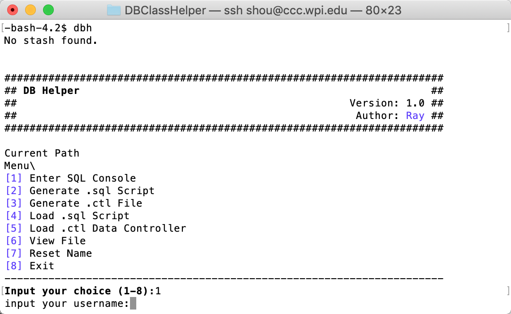

# DBHelper

##Install

`$ git clone https://github.com/songlinhou/DBHelper;cd DBHelper;chmod +x setup.sh;./setup.sh;source ~/.bash_profile`

##Use

Database Helper(General utilities):
`dbh`

Database Packer(Data Loader):
`dbp`

## Interface

DB Helper

DB Packer

